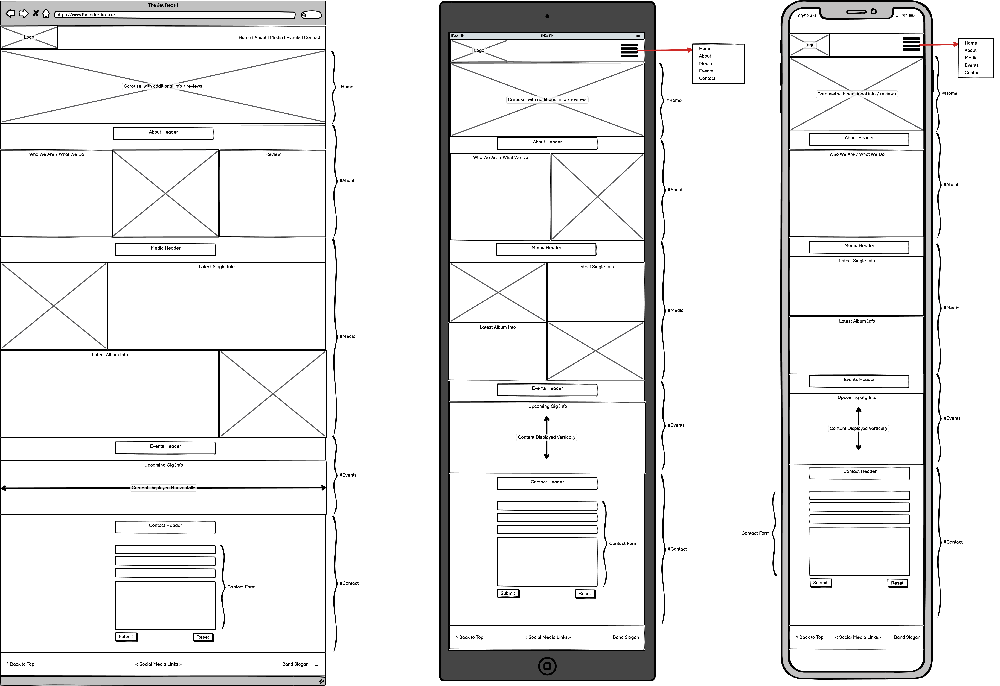

# The Jet Reds website

This website was created as a first portfolio project for Code Institute's Diploma in Web Application Development. The Jet Reds are a real band but, with their permission, I have created this website as I have an interest in and actively follow the band.

## Table of Contents

- [UX and UI](#ux-and-ui)
  - [Site Owner Goals](#site-owner-goals)
  - [User Stories](#user-stories)
  - [Wireframes](#wireframes)
- [Design](#design)
- [Features](#features)
- [Deployment](#deployment)
- [Testing](#testing)
- [Credits](#credits)
  - [Languages](#languages)
  - [Frameworks, Libraries and Tools](#frameworks-libraries-and-tools)

## UX and UI

#

- ### Site Owner Goals

  The goal of the site for the owner is to:

  1. Keep fans up to date with the bands latest releases.
  2. Provide some background information about the band, and the type of music they play.
  3. Make fans aware of any upcoming events, including venue, date and time.

- ### User Stories

  - #### First Time Visitor Goals

    1. As a first time user, I want to easily understand the type of music played by the band.
    2. As a first time user, I want to be able to easily navigate around the site to find the content I'm looking for.
    3. As a first time user, I'd like to see reviews, to see the opinions of others about the band.

  - #### Returning Visitor Goals

    1. As a returning visitor, I want to find information about any new releases by the band.
    2. As a returning visitor, I want to easily find information about any upcoming shows.
    3. As a returning visitor, I want to find the best way to follow the band on social media.

  - #### Commercial Visitor Goals

    1. As a commercial visitor, I want to easily contact the band with any booking enquiries.

  ## Wireframes

  The wireframes for this site were created using Balasmiq, with each section and subsection noted. I endeavoured to create a single page website and, as such, wireframes are available for desktop view, tablet view and mobile view.

  The first section below shows all views together, with the second second making individual views available.

  

  
Collective Wireframe Image(Desktop, Tablet & Mobile)

  
  

  

  
Individual Wireframe Images

  

## Design

#

## Features

#

## Deployment

#

## Testing

#

## Credits

#

- ## Languages

  #

  - [HTML5](https://en.wikipedia.org/wiki/HTML5)
  - [CSS](https://en.wikipedia.org/wiki/CSS)
  - [Javascript](https://en.wikipedia.org/wiki/JavaScript)

- ## Frameworks, Libraries and Tools

  #

  - [Am I Responsive](http://ami.responsivedesign.is/) - Used to verify responsiveness of website on different devices.
  - [Balsamiq](https://balsamiq.com/) - Used to generate Wireframe images.
  - [Bootstrap](https://getbootstrap.com/) - Main framework used for the site, with a focus on responsiveness.
  - [Chrome Dev Tools](https://developer.chrome.com/docs/devtools/) - Used for overall development and tweaking, including testing responsiveness and performance.
  - [Favicon.io](https://favicon.io) - Used to generate Favicon image.
  - [Font Awesome](https://fontawesome.com/) - Used for Social Media icons in footer.
  - [GitHub](https://github.com/) - Used for version control and hosting.
  - [Google Fonts](https://fonts.google.com/) - Used to import and alter fonts on the page.
  - [JQuery](https://en.wikipedia.org/wiki/JQuery) - Used to override default submit functionality and display modal instead.
  - [Slack](https://slack.com/) - Used for support and advice from the Code Insitute Community.

- ## Images
- ## Content
